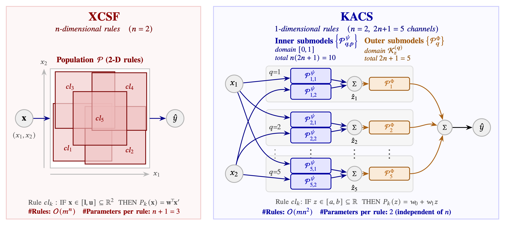

# KACS: Kolmogorov-Arnold Classifier System <!-- omit in toc -->
This repository contains the implementation for the IEEE Transactions on Evolutionary Computation article:

>Hiroki Shiraishi, Hisao Ishibuchi, and Masaya Nakata. **Kolmogorov-Arnold Classifier Systems as Universal Approximators**. IEEE Transactions on Evolutionary Computation, Early Access, Sep. 2026. [DOI: 10.1109/TEVC.2026.3736664](https://doi.org/10.1109/TEVC.2026.3736664).

This repository provides the implementation of **KACS** (Kolmogorov-Arnold Classifier System), an online evolutionary rule-based machine learning system (a.k.a. [Learning Classifier System: LCS](https://en.wikipedia.org/wiki/Learning_classifier_system) <sup><a id="ref1"></a>[[1]](#1)</sup>) for function approximation that reorganizes its rule population dimension-wise, guided by the Kolmogorov-Arnold (KA) representation theorem <sup><a id="ref2"></a>[[2]](#2)</sup> <sup><a id="ref3"></a>[[3]](#3)</sup> <sup><a id="ref4"></a>[[4]](#4)</sup> <sup><a id="ref5"></a>[[5]](#5)</sup>. The implementation is written entirely in Julia, and includes a reference implementation of **XCSF** <sup><a id="ref6"></a>[[6]](#6)</sup> <sup><a id="ref7"></a>[[7]](#7)</sup>, the most widely studied LCS for function approximation, as its baseline for comparison.

## Table of Contents <!-- omit in toc -->
- [What is KACS?](#what-is-kacs)
- [Kolmogorov-Arnold Representation Theorem](#kolmogorov-arnold-representation-theorem)
- [Brief Algorithm of KACS](#brief-algorithm-of-kacs)
- [KACS is a Universal Approximator](#kacs-is-a-universal-approximator)
- [Setup and Usage Guide](#setup-and-usage-guide)
- [Copyright](#copyright)
- [References](#references)

## What is KACS?



Traditional LCSs, including XCSF <sup><a id="ref6"></a>[[6]](#6)</sup> <sup><a id="ref7"></a>[[7]](#7)</sup>, partition the *n*-dimensional input space directly, so both rule count and parameter count grow exponentially with *n* (O(*m*ⁿ)). KACS avoids this by decomposing the target function, via the KA representation theorem, into one-dimensional inner and outer functions and assigning a dedicated one-dimensional ruleset to each — as illustrated above. This:

* Reduces the worst-case rule count from O(*m*ⁿ) to O(*mn*²).
* Cuts each rule's consequent to just **two** parameters, independent of *n*.
* Updates all rules jointly via system-level backpropagation, instead of each rule learning from its own local error as in XCSF.
## Kolmogorov-Arnold Representation Theorem

The KA representation theorem <sup><a id="ref2"></a>[[2]](#2)</sup> <sup><a id="ref3"></a>[[3]](#3)</sup> <sup><a id="ref4"></a>[[4]](#4)</sup> <sup><a id="ref5"></a>[[5]](#5)</sup> states that any continuous function of *n* variables can be represented *exactly* as a finite superposition of one-dimensional functions:

```math
f(x_1,\dots,x_n) = \sum_{q=1}^{2n+1} \Phi_q\!\left(\sum_{p=1}^{n} \varphi_{q,p}(x_p)\right),
```

where φ<sub>q,p</sub> are called *inner functions* and Φ<sub>q</sub> are called *outer functions* — only (*n*+1)(2*n*+1) one-dimensional functions in total, a quadratic rather than exponential dependence on *n*. The theorem guarantees that this decomposition *exists*, but it does not specify a unique or readily computable set of φ and Φ; KACS instead *learns* them from data, representing each one as its own one-dimensional ruleset (see below).

## Brief Algorithm of KACS

Like XCSF, KACS learns online, one training sample at a time:

1. **Feedforward prediction**: evaluate the one-dimensional inner submodels, sum them into intermediate values, then evaluate the outer submodels on those sums to get the final prediction (covering rules are generated for any empty submodel match set).
2. **Backpropagation**: backpropagate the system-level squared error through this two-stage structure and update every active rule's weights with Adam.
3. **Parameter update**: update each active rule's experience, error, accuracy, and fitness (using the system-level error, and computed within its own submodel's match set).
4. **GA and subsumption**: periodically apply tournament selection, crossover, and mutation within each submodel match set, then subsumption and roulette-wheel deletion, exactly as in standard XCS.


## KACS is a Universal Approximator

This article proves that KACS is a universal approximator for continuous functions on compact domains — the first such proof for any LCS. Formally, let 𝒦 = [0, 1]ⁿ and let 𝓕<sub>KACS</sub> denote the set of all functions expressible by KACS models on 𝒦:

```math
\forall f \in C(\mathcal{K}),\ \forall \varepsilon>0,\ \exists\, g \in \mathcal{F}_{\text{KACS}} \text{ s.t. } \sup_{\mathbf{x}\in \mathcal{K}} |f(\mathbf{x}) - g(\mathbf{x})| < \varepsilon.
```

That is, for any continuous target function and any desired accuracy, there always exists a finite KACS model that achieves it.

## Setup and Usage Guide
### Requirements <!-- omit in toc -->
* Julia v1.9 or higher (download [here](https://julialang.org/downloads/#official_binaries_for_manual_download))
* Packages: ArgParse, CSV, DataFrames, Dates, Distributions, LinearAlgebra, Printf, Random (versions are pinned in `Project.toml` / `Manifest.toml`, bundled with this repository)

### Installation <!-- omit in toc -->
Clone the repository and navigate into the project directory:
```bash
git clone https://github.com/YNU-NakataLab/KACS.git
cd KACS
```

This repository ships with a pre-generated `Project.toml` and `Manifest.toml`, recording the exact package versions used to produce the reported results. Install them with a single command; you only need to do this once:
```bash
# From within the KACS directory:
julia --project=. -e 'using Pkg; Pkg.instantiate()'
```

Once setup is complete, run any experiment with the `--project=.` flag to ensure the correct environment is used every time.

### Usage <!-- omit in toc -->
You can train a KACS or XCSF model using any tabular dataset (e.g., `yourfile.csv`) for regression via the command line interface. Note that:
* The rightmost column of the CSV file must represent the actual real value to be predicted, while all other columns should constitute the input features.
* Any missing values in the dataset should be represented by a question mark (`?`).
* Ensure that the CSV file does not contain a header row; the data should start from the first line.

Here are examples of how to run the models:

#### Run KACS <!-- omit in toc -->
```bash
julia --project=. main.jl --csv dataset/yourfile.csv -s kacs
```
#### Run XCSF <!-- omit in toc -->
```bash
julia --project=. main.jl --csv dataset/yourfile.csv -s xcsf
```
#### For Further Details <!-- omit in toc -->
```bash
julia --project=. main.jl --help
```
This prints every hyperparameter (`-N`, `--beta`, `--e0`, `--theta_EA`, `--chi`, `--mu`, `--theta_del`, `--theta_sub`, `--delta`, `--r0`, `--m0`, `--F_I`, `--tau`, `--do_subsumption`, `--P_hash`, `--iteration`, `--num_trials`) together with its description and default value.

### Reproducing Paper Results <!-- omit in toc -->
To reproduce the results from the paper, edit the dataset list in `main_all_csv` (`main.jl`) and run:
```bash
julia --project=. main.jl -s kacs --all true
julia --project=. main.jl -s xcsf --all true
```

### Output Examples <!-- omit in toc -->
Upon completion of a trial, KACS/XCSF writes its results to `./result/<dataset>/<system>/<timestamp>/trial<n>/`, containing the following files:

| File | Content |
|---|---|
| `train_syserr.csv`, `test_syserr.csv` | Mean absolute error per interval (train/test) |
| `train_mse.csv`, `test_mse.csv` | Mean squared error per interval (train/test) |
| `popsize.csv`, `micro_popsize.csv` | Macro-/micro-rule population size per interval |
| `number_of_parameters.csv` | Number of free consequent-weight parameters in the population |
| `aic.csv` | Akaike Information Criterion, capturing the accuracy-complexity trade-off |
| `number_of_covering.csv`, `number_of_deletion.csv` | Covering/deletion operator trigger counts per interval |
| `classifier.csv` | Final rule population (antecedent, weights, fitness, error, experience, numerosity, and — for KACS — submodel type/*q*/*p* indices) |
| `summary.csv` | Console log table (interval, iteration, train/test error, population size, covering rate, subsumption count) |
| `parameter.csv` | Hyperparameter values used for the run |

An example of the console log produced during training is shown below.
```
   Interval   Iteration    TrainErr     TestErr     PopSize  CovOccRate   SubOccNum
=========== =========== =========== =========== =========== =========== ===========
          1        2000    0.312800    0.328500     412.000       0.086           4
          2        4000    0.256300    0.271900     889.000       0.021          31
          3        6000    0.221400    0.238600    1340.000       0.009          58
```

## Copyright

The copyright of this KACS repository belongs to the authors in the [Evolutionary Intelligence Research Group](http://www.nkt.ynu.ac.jp/en/) (Nakata Lab) at Yokohama National University, Japan. You are free to use this code for research purposes. In such cases, we kindly request that you cite the following article:

>Hiroki Shiraishi, Hisao Ishibuchi, and Masaya Nakata. **Kolmogorov-Arnold Classifier Systems as Universal Approximators**. IEEE Transactions on Evolutionary Computation, Early Access, Sep. 2026. https://doi.org/10.1109/TEVC.2026.3736664.

```bibtex
@article{shiraishi2026kacs,
  title   = {Kolmogorov-Arnold Classifier Systems as Universal Approximators},
  author  = {Shiraishi, Hiroki and Ishibuchi, Hisao and Nakata, Masaya},
  journal = {IEEE Transactions on Evolutionary Computation},
  year    = {2026},
  doi     = {10.1109/TEVC.2026.3736664},
  note    = {Early access}
}
```

## References
<a id="1"></a>
[1] Ryan J. Urbanowicz and Will N. Browne. **Introduction to Learning Classifier Systems**. 1st ed. Springer Publishing Company, Incorporated, 2017. [[↑]](#ref1)

<a id="2"></a>
[2] Andrei N. Kolmogorov. "**On the representation of continuous functions of several variables by superpositions of continuous functions of a smaller number of variables**." American Mathematical Society, 1961. (English translation.) [[↑]](#ref2)

<a id="3"></a>
[3] А. Н. Колмогоров. "**О представлении непрерывных функций нескольких переменных в виде суперпозиций непрерывных функций одного переменного и сложения**." *Доклады Академии наук*, vol. 114, no. 5, pp. 953-956, 1957. (Original Russian publication of [2].) [[↑]](#ref3)

<a id="4"></a>
[4] Vladimir I. Arnold. "**On functions of three variables**." Collected Works: Representations of Functions, Celestial Mechanics and KAM Theory, 1957-1965 (2009): 5-8. (English translation.) [[↑]](#ref4)

<a id="5"></a>
[5] В. И. Арнольд. "**О представлении непрерывных функций трех переменных суперпозициями непрерывных функций двух переменных**." *Математический сборник*, vol. 48(90), no. 1, pp. 3-74, 1959. (Original Russian publication of [4].) [[↑]](#ref5)

<a id="6"></a>
[6] Stewart W. Wilson. "**Classifiers that approximate functions**." Natural Computing 1.2 (2002): 211-234. https://doi.org/10.1023/A:1016535925043 [[↑]](#ref6)

<a id="7"></a>
[7] Preen, Richard J., Stewart W. Wilson, and Larry Bull. "**Autoencoding with a classifier system**." IEEE Transactions on Evolutionary Computation 25.6 (2021): 1079-1090. https://doi.org/10.1109/TEVC.2021.3079320 [[↑]](#ref7) 


